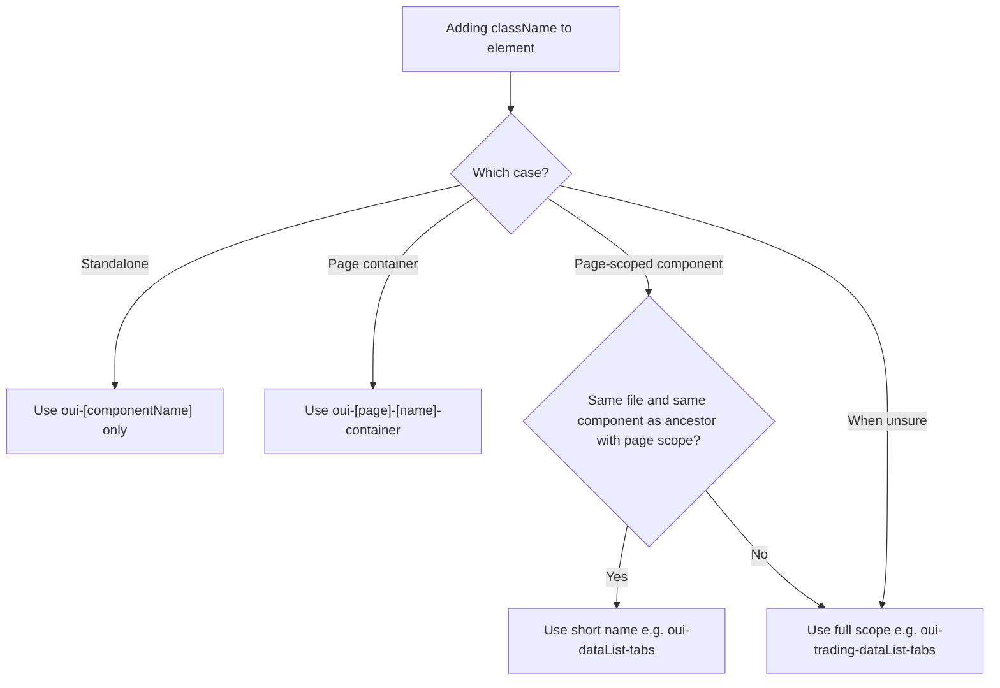

# Add Component ClassNames (Style Override Hooks)

Add `className` attributes with `oui-*` to interactive components and key containers so consumers can target them for style overrides (e.g. `.oui-assetView`, `.oui-trading-dataList-tabs`). Only add classNames; do not change logic or existing CSS class names.

## Terms

- **Page scope**: The page/module prefix in a className (e.g. `oui-trading`, `oui-orderEntry`). An element “has page scope” when its className starts with that prefix.
- **Area**: A logical region on a page (e.g. dataList, orderBook). Optional in naming when the page has multiple regions.
- **Component name**: The React component or section name, camelCase (e.g. orderBook, dataList-tabs).
- **Sub-element**: A structural or role part inside a component (e.g. header-price, depth), kebab-case.
- **Semantic override className**: An `oui-*` className used so consumers can target the element for style overrides (not a utility class like `oui-relative`).

## Rules (must follow)

### Prefix and naming

- **Prefix**: All style-override classNames start with `oui-`. Map package to module name (e.g. `@orderly.network/trading` → `oui-trading`, `@orderly.network/markets` → `oui-markets`). For other packages, use the last segment or main module name (e.g. `@orderly.network/xyz` → `oui-xyz`); if the package name differs from the page, use the team’s agreed module name.
- **Naming style**: **Component names** and **area names** (corresponding to React component or page region) use **camelCase**, e.g. `oui-assetView`, `oui-orderBook`, `oui-dataList-tabs` (where `dataList` is the area). **Sub-element names** (structure or role inside a component) use **kebab-case**, e.g. `oui-orderBook-header-price`, `oui-orderBook-depth`. So classNames mix camelCase and kebab-case.

### Decision flow

**Scope rule**: Omit page scope on the current element only when it is in the **same file** and **same component** as an ancestor that already has page scope; otherwise use full page scope. When in doubt, use full page scope (e.g. `oui-trading-dataList-tabs`) for selector stability.



### Three cases

1. **Standalone component**  
   Reusable component not tied to a specific page/module: use `oui-[componentName]` only. If a component is only used on one page, its **root** can still use the short name (e.g. `oui-orderBookAndTrades`); children in that section can use short names when they are in the **same file and same component** as an ancestor that already has page scope.  
   Examples: `oui-assetView`, `oui-accountSheet`, `oui-bottomNavBar`, `oui-riskRate`, `oui-orderBookAndTrades`, `oui-faucet-btn`.

2. **Page-scoped component**  
   Component lives in a package and is primarily used on that page: use **page scope** `oui-[page]-[area?]-[componentName]`.
   - Omit `[page]` only when the element is in the **same file and same component** as an ancestor that already has page scope (e.g. both in `additionalInfo.tsx` in the same component → child can use `oui-dataList-tabs`). Otherwise use full scope (e.g. `oui-trading-dataList-tabs`).
   - Optional `[area]` when the component belongs to a sub-area: include area when the page has multiple logical regions (e.g. dataList, layout, positions) and names could collide or when it helps group overrides; omit when there is no ambiguity.  
     Examples:
   - `oui-trading-orderBook`, `oui-trading-lastTrades`, `oui-trading-tradingview`, `oui-trading-topTab`
   - `oui-trading-dataList-setting`, `oui-trading-dataList-setting-trigger-btn` (area: dataList)
   - Tabs root of a section: `oui-trading-dataList-tabs` or `oui-dataList-tabs` when in same file and same component as an ancestor with `oui-trading-*`

3. **Page-level wrapper (layout container)**  
   The **outermost** layout node that wraps a section on a page gets page scope and ends with `-container`; only this node uses `-container` for that section (inner wrappers or the component root use case 2, e.g. `oui-trading-orderBook`).  
   Format: `oui-[page]-[componentName]-container`. **componentName** is the section's name (the same area/component name as in case 2): use camelCase, whether it's a main area (e.g. `orderBook`, `dataList`) or a named sub-section (e.g. `symbolInfoBar`). This container is the page-scoped root for that section; elements in the **same file and same component** as this container may omit page scope.  
   Examples: `oui-trading-tradingview-container`, `oui-trading-markets-container`, `oui-trading-symbolInfoBar-container`, `oui-trading-orderBook-container`, `oui-trading-dataList-container`, `oui-trading-orderEntry-container`.

### Sub-elements within a component

For elements inside a component (header, depth select, desktop/mobile variant): use `oui-[parentComponent]-[subElement]` with parent in camelCase and sub-elements in kebab-case. No need to repeat page scope if an ancestor in the same file and same component already has it.  
Examples:

- `oui-orderBook-header-price`, `oui-orderBook-header-qty`, `oui-orderBook-header-total-quote`, `oui-orderBook-header-total-base`
- `oui-orderBook-depth`, `oui-orderBook-mark-price`
- `oui-orderBook-desktop`, `oui-orderBook-mobile`

### Form controls and labels (when ancestor has scope)

When an **ancestor in the same file and same component** already has page or component scope (e.g. `oui-orderEntry-additionalInfo`), **form controls** (Checkbox, Switch, Radio) and their **labels** may use **short semantic names** and need not repeat the parent component name.

- **Format**: `oui-[semanticRole]-[controlType]`
  - **semanticRole**: The business meaning of the control, camelCase (e.g. postOnly, ioc, fok, orderConfirm, orderHidden, keepVisible).
  - **controlType**: The control type, kebab-case (e.g. `checkbox`, `label`, `switch`).
- **Examples**: `oui-postOnly-checkbox`, `oui-postOnly-label`, `oui-orderConfirm-checkbox`, `oui-keepVisible-switch`, `oui-keepVisible-label`. Children do not need long names like `oui-orderEntry-additionalInfo-postOnly-checkbox`; short semantic names avoid redundancy and make override selectors easier.

### Buttons and triggers

Use `oui-[scope]-[action]-btn` or `oui-[scope]-[component]-[action]-btn`. Use `oui-[scope]-[component]-[action]-btn` when the button is a child control of a component (e.g. setting’s trigger); use `oui-[scope]-[action]-btn` when the button is a page/module-level action (e.g. deposit, disconnect).  
Examples: `oui-assetView-deposit-btn`, `oui-assetView-toggle-visibility-btn`, `oui-trading-dataList-setting-trigger-btn`, `oui-faucet-btn`, `oui-accountSheet-disconnect-btn`.

### Uniqueness and lists

- **Uniqueness**: When targeting a single element for overrides, prefer a className that is unique within that component tree; when the selector is meant to style “any of these” elements, multiple nodes can share the same className.
- **Dynamic lists**: For list items that need a unique override hook, use a unique field from the data in the className (e.g. `oui-trading-orders-list-item-${order.id}`). Do **not** use array index.

### What not to change

- **Add className only**: Add or merge the `className` prop only (via `cn()` or space-separated string). Do not change event handlers, conditions, or component structure.
- **Existing classNames**: If an element already has an override className (`oui-*`), do not change it. If it does not follow this convention, suggest a better one but do not modify the code.
- **Semantic id**: Checkbox/label etc. can keep `id` for `htmlFor` association and add `className="oui-checkbox-hideOtherSymbols"` for style overrides.

## Target elements

- **Interactive**: Button, Input, Select, Checkbox, Radio, Modal, Tabs, Dropdown, etc.
- **Containers**: Form sections, list roots, step containers, modal roots (so consumers can target whole areas for styling).

**Override hooks vs utility classes**: This skill defines **semantic override classNames** (e.g. `oui-assetView`, `oui-dataList-tabs`) so consumers can target elements for style overrides. If the project uses oui-prefixed utility classes (e.g. scoped Tailwind), those can coexist; this skill’s rules apply to the semantic override class names.

## Boundary cases

- **Nested components**: Component A (e.g. `oui-orderEntry-additionalInfo`) contains component B (e.g. a reusable `Tabs`). B's root gets a className that reflects its role in A (e.g. `oui-additionalInfo-tabs` or `oui-dataList-tabs` if that's the area). Inner component's root gets area/component scope; don't repeat parent's full path unless needed for uniqueness.
- **Conditional rendering**: Same rule as non-conditional; put className on the rendered branch only. No special suffix.
- **List items**: For a repeated control (e.g. button in each row), use a **shared** className (e.g. `oui-orders-row-action-btn`) when styling "any of these"; use item-scoped className when targeting one (e.g. `oui-orders-list-item-${order.id}`). Use a unique data field (e.g. `order.id`), not index.
- **Cross-package**: Component from package A used in package B: use the **consuming page's** scope for the outer wrapper (e.g. on trading page use `oui-trading-...`). Inner roots can use short names only when they are in the same file and same component as an ancestor with that scope.

## Examples

In the examples below, names like `oui-assetView` are semantic override classNames; `oui-relative` and similar are project utility classes and can coexist with override classNames.

**Standalone component**

```tsx
<Box className="oui-relative oui-assetView">
<Flex className="oui-accountSheet" ... >
<Button className="oui-assetView-deposit-btn" ... >
```

**Page-scoped (trading package)** — use full scope unless element is in same file and same component as ancestor with page scope

```tsx
<Box className="oui-trading-orderBook ..." ... >
<Tabs className={cn("oui-trading-dataList-tabs", className)} ... >
<Flex className="oui-trading-layout-switchLayout" ... >
<Flex className="oui-trading-dataList-setting" ... >
<Button className="oui-trading-dataList-setting-trigger-btn" ... >
```

**When in same file and same component as ancestor with page scope — can shorten**

```tsx
// Same component has oui-trading-dataList-container
<Tabs className={cn("oui-dataList-tabs", className)} ... >

// Same component has oui-trading-orderBookAndTrades
<div className="oui-orderBookAndTrades ...">
  <Box className="oui-orderBook ..." />
```

**When in different file or different component — use full scope**

```tsx
// Tabs is in another file/component; no ancestor with page scope in same component
<Tabs className={cn("oui-trading-dataList-tabs", className)} ... >
```

**Page-level containers**

```tsx
<Box className="oui-trading-tradingview-container oui-overflow-hidden" ... >
<Box className="oui-trading-markets-container ..." ... >
<Box className="oui-trading-symbolInfoBar-container" ... >
```

**Sub-elements**

```tsx
<Title className="oui-orderBook-header-price ..." ... >
<Box className="oui-orderBook-depth oui-w-full oui-pt-2" ... >
<div className={cn("oui-orderBook-desktop", ...)} ... >
```

**Form controls (short semantic names)** — when ancestor in same file and same component has scope (e.g. `oui-orderEntry-additionalInfo`), use `oui-[role]-[controlType]` for checkboxes, switches, and labels:

```tsx
// Same component has oui-orderEntry-additionalInfo
<Checkbox className={cn("oui-postOnly-checkbox", "oui-peer")} ... />
<label className={cn("oui-postOnly-label", ...)} ... />
<Checkbox className={cn("oui-ioc-checkbox", "oui-peer")} ... />
<label className={cn("oui-ioc-label", ...)} ... />
<Checkbox className="oui-orderConfirm-checkbox" ... />
<label className="oui-orderConfirm-label ..." ... />
<Switch className="oui-keepVisible-switch" ... />
<label className="oui-keepVisible-label ..." ... />
```

**Dynamic list (use data id, not index)**

```tsx
// Good
<div className={`oui-trading-orders-list-item-${order.id}`}>

// Bad – do not use index
<div className={`oui-trading-orders-list-item-${index}`}>
```

**Merging with existing className**

```tsx
className={cn("oui-trading-topTab", props.className)}
className="oui-trading-orderBook-container oui-overflow-hidden"
```

## Checklist

After adding classNames:

- [ ] Standalone vs page-scoped vs page-container: used correct pattern; **full page scope** when the element is not in the same file and same component as a scoped ancestor, or when unsure; **omitted page scope** only when the element is in the same file and same component as an ancestor that already has page scope.
- [ ] All override classNames use `oui-` prefix; component and area names in camelCase, sub-elements in kebab-case.
- [ ] Sub-elements use oui-[parentComponent]-[subElement] (parent camelCase, subElement kebab-case).
- [ ] When an ancestor in the same file and same component has page/component scope, form controls and labels prefer short semantic names `oui-[role]-checkbox` / `oui-[role]-label` / `oui-[role]-switch` instead of long parent-prefixed names.
- [ ] Buttons/triggers use -btn suffix where applicable.
- [ ] Dynamic lists use a unique data field (e.g. `item.id`), not index.
- [ ] Only `className` was added or merged; logic and structure unchanged.
- [ ] Existing override classNames were left as-is; if they don't match convention, suggest a better name in text only and do not change the code.
