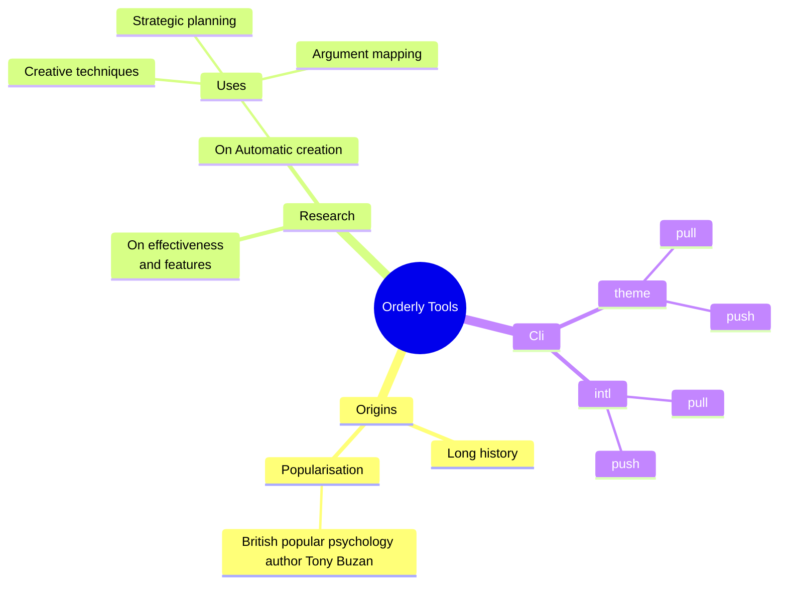
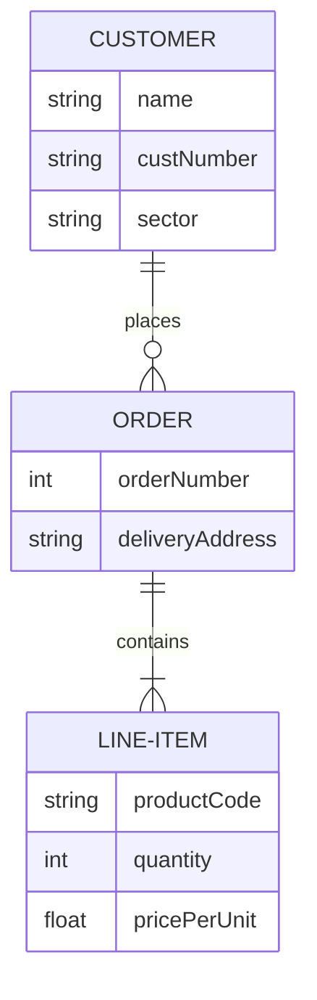

# Overview

```mermaid
mindmap
  root((Orderly Tools))
    Origins
      Long history
      ::icon(fa fa-book)
      Popularisation
        British popular psychology author Tony Buzan
    Research
      On effectiveness<br/>and features
      On Automatic creation
        Uses
            Creative techniques
            Strategic planning
            Argument mapping
    Cli
      theme
        pull
        push
      intl
        pull
        push
```

```mermaid
erDiagram
    CUSTOMER ||--o{ ORDER : places
    CUSTOMER {
        string name
        string custNumber
        string sector
    }
    ORDER ||--|{ LINE-ITEM : contains
    ORDER {
        int orderNumber
        string deliveryAddress
    }
    LINE-ITEM {
        string productCode
        int quantity
        float pricePerUnit
    }
```