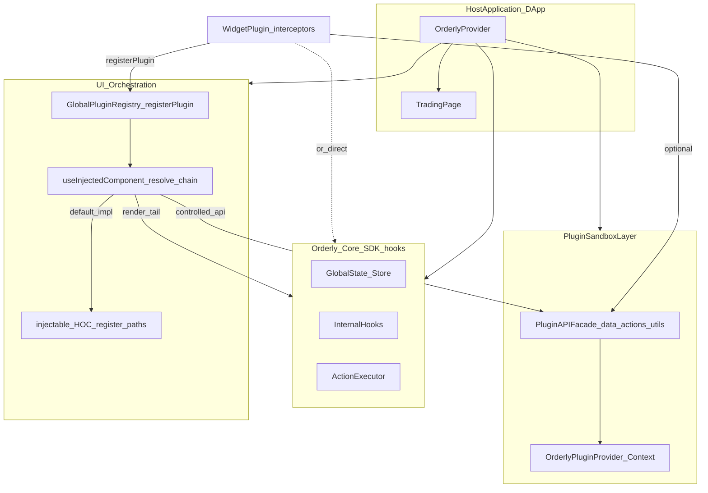

# Orderly SDK plugin system — technical design

---

## 1. Supported plugin types (overview)

The Orderly SDK plugin system supports three kinds of extensions:

| Type       | Definition                                      | Integration                                                                    | Typical scenarios                            |
| :--------- | :---------------------------------------------- | :----------------------------------------------------------------------------- | :------------------------------------------- |
| **Page**   | Full page built with SDK UI and Hooks           | Host mounts as a normal routed component                                       | Standalone pages (assets, history, etc.)     |
| **Widget** | UI block anchored at a path on the trading page | Interceptor declares `target`; SDK injects at that node                        | PnL cards, custom buttons beside order entry |
| **Layout** | Container that rearranges the trading layout    | Intercept top-level layout, receive children (chart, order book) and rearrange | Multi-column, sidebars, custom chrome        |

- **Page**: No SDK interceptors/registry—rendered directly by the host router.
- **Widget**: Uses **path-based interceptors** and injected `api` (or `@orderly.network/hooks` directly); main way to extend trading UI.
- **Layout**: A Widget that intercepts the top container (e.g. trading layout) and reorders children.

---

## 2. Plugin types in detail

### 2.1 Page plugins

- **Definition**: A full page built with Orderly SDK UI and Hooks.
- **How to build**: Use SDK UI and Hooks only—no extra interceptors or registry.
- **Integration**: The host wires routes (React Router, Next.js Router, etc.); the SDK does not mandate a router.

### 2.2 Widget plugins

- **Mechanism**: Declare interceptors in the `interceptors` array for specific paths.
- **Interceptor shape**: `component` is `(Original, props, api) => ReactNode`—wrap, prepend, append, or replace `Original`; you may also use `@orderly.network/hooks` directly.
- **Dynamics**: No slots required—set `target` to an anchor path (e.g. `Trading.OrderEntry.SubmitSection`) and the SDK injects there.

### 2.3 Layout plugins

- **Mechanism**: Intercept the top trading layout container.
- **Behavior**: Receives existing children (chart, order book, etc.) as props and rearranges them.

---

## 4. Plugin ID

The unique ID enables API provenance (which plugin issued a request), per-plugin rate limits, usage, and auditing—a **prerequisite** for plugin development.

- **Generation**: Use the Orderly plugin CLI/scaffold (`generate-id`, etc.) for local IDs without a web login.
- **Transparency**: `registerPlugin({ id: '...' })` stores the ID; controlled `fetch` wrappers can attach it for server-side tracking.

---

## 5. Lifecycle management

The SDK orchestrates lifecycle hooks:

| Hook           | When                                  | Typical use                      |
| :------------- | :------------------------------------ | :------------------------------- |
| `onInitialize` | After plugin code loads, before mount | Init state, subscribe to buses   |
| `onInstall`    | First install                         | Version checks, capability gates |
| `onMount`      | Interceptor or page enters the DOM    | Timers, analytics                |
| `onUnmount`    | Removed from DOM                      | Cleanup (like `useEffect`)       |
| `onDispose`    | Plugin disabled/uninstalled           | Clear persisted data             |

> **Note:** `plugin-core` today may not implement every hook in this table; see the published API and [GUIDE.md](./GUIDE.md) §7 for the supported set.

---

## 7. Developer experience (DX)

1. **Inspector**: Highlights interceptable paths in the UI (hover a control to see e.g. `Trading.OrderEntry.SubmitSection`).
2. **Orderly plugin development Skill**: Scaffolds templates, IDs, and starter code.
3. **Types**: TypeScript completion for paths and interceptor props when packages are imported.

---

## 3. Architecture and design

### 3.1 Design principles

- **Minimal intrusion**: Core SDK logic should not be littered with slot code.
- **Isolation**: Limit direct global state access via facades for trading safety.
- **Intercept everything important**: Interceptor pattern to enhance, wrap, or replace core UI.
- **Visual consistency**: Steer plugins toward the base UI kit.

### 3.2 System architecture (Widget plugin)



### 3.3 Core design

#### 3.3.1 UI layer: path-based component interceptors

The SDK combines **`injectable`** (wrap at definition site) and **`useInjectedComponent`** (resolve at render site). Plugins declare `(Original, props, api) => ReactNode`.

**(1) Declaring interception**

```typescript
// Example registration
import type { OrderlySDK } from "@orderly.network/ui";

OrderlySDK.registerPlugin({
  id: "pnl-visualizer",
  interceptors: [
    {
      target: "Trading.OrderEntry.SubmitSection",
      component: (Original, props, api) => (
        <div className="flex flex-col">
          <Original {...props} />
        </div>
      ),
    },
  ],
});
```

Use `@orderly.network/hooks` inside a wrapper component—not in the outer interceptor function (Rules of Hooks).

**(2) `useInjectedComponent` — resolve at render site (SDK internal)**

This hook runs where the UI is actually rendered. It collects interceptors for `name`, chains them (onion), and returns a renderable component; with no interceptors it returns the **default** passed as the second argument.

```tsx
// Illustrative SDK-internal shape (imports omitted: useOrderlyPluginContext, types).
import React, { useMemo } from "react";

export function useInjectedComponent<P extends object>(
  name: string,
  DefaultComponent: React.ComponentType<P>,
): React.ComponentType<P> {
  const { plugins, apiFacade } = useOrderlyPluginContext();

  return useMemo(() => {
    const interceptors = plugins
      .flatMap((p) => p.interceptors ?? [])
      .filter((i) => i.target === name);

    if (interceptors.length === 0) {
      return DefaultComponent;
    }

    return (props: P) => {
      let CurrentRender = (p: P) => <DefaultComponent {...p} />;

      interceptors.forEach((interceptor) => {
        const PreviousRender = CurrentRender;
        CurrentRender = (currentProps: P) =>
          interceptor.component(
            PreviousRender as never,
            currentProps,
            apiFacade,
          );
      });

      return <>{CurrentRender(props)}</>;
    };
  }, [plugins, apiFacade, name, DefaultComponent]);
}
```

Example usage inside SDK UI (conceptual paths):

```tsx
const SubmitSection = useInjectedComponent(
  "Trading.OrderEntry.SubmitSection",
  DefaultSubmitSection,
);
```

| Scenario    | Meaning                          | Example                            |
| :---------- | :------------------------------- | :--------------------------------- |
| **Enhance** | Add UI before/after the original | Tip text under the button          |
| **Logic**   | Adjust props (e.g. `disabled`)   | Maintenance window disables submit |
| **Replace** | Ignore `Original`                | Fully custom submit UI             |

**(3) `injectable` — wrap at definition site (SDK internal)**

```tsx
const InternalSubmit = (props: Props) => {
  /* ... */
};

export const SubmitSection = injectable(
  InternalSubmit,
  "Trading.OrderEntry.SubmitSection",
);
```

`injectable` typically delegates to `useInjectedComponent` so every import path is interceptable.

| Topic           | Notes                                                                                                                             |
| :-------------- | :-------------------------------------------------------------------------------------------------------------------------------- |
| **Memoization** | Returned component type must be stable when `plugins` (etc.) are unchanged—otherwise React remounts children (inputs lose focus). |
| **Props**       | Props flow through the whole chain to `Original` or the final JSX.                                                                |
| **Naming**      | Prefer dotted namespaces (`Trading.OrderEntry.*`) for docs and targeting.                                                         |
| **Default**     | With zero interceptors, cost is essentially one hook + default render.                                                            |

#### 3.3.2 Logic layer: plugin API (facade) and Hooks

Plugins may **import `@orderly.network/hooks` directly** or use an injected **`api`** (from `OrderlyPluginProvider`) for `setup` and similar non-component contexts.

The concrete `api` shape in your SDK version may include `events` and placeholders for future `data` / `actions` / `utils`—see `@orderly.network/plugin-core` and [GUIDE.md](./GUIDE.md) §3.

#### 3.3.2.1 Context, Provider, and `useOrderlyPluginContext`

`OrderlyPluginProvider` supplies `plugins` and the injected API to descendants; `useInjectedComponent` reads that context to build the interceptor chain. Keep `api` / context value referentially stable (`useMemo`) to avoid unnecessary re-renders.

#### 3.3.3 Plugin package shape and loading

Plugins are **npm packages + register functions**; the host calls `registerXPlugin()` and passes the result into `OrderlyPluginProvider` `plugins`. Bundlers handle code-splitting/tree-shaking; the SDK maintains registration and resolution.

**(1) Standard export**

```typescript
export default function registerPnlPlugin(options?: { theme?: string }) {
  return (SDK: OrderlySDK, state?: unknown) =>
    SDK.registerPlugin({
      id: "orderly-pnl-plugin",
      name: "PnL visualizer",
      version: "1.0.0",
      orderlyVersion: ">=1.0.0",
      interceptors: [
        {
          target: "Trading.Some.Anchor",
          component: (Original, props) => (
            <>
              <PnlCard theme={options?.theme} />
              <Original {...props} />
            </>
          ),
        },
      ],
      setup: (api) => {
        api.events.on("place_order_success", () => {});
      },
    });
}
```

**(2) Host integration**

See [GUIDE.md](./GUIDE.md) §9—pass invoked factories to `OrderlyPluginProvider` `plugins`.

**(3) Engineering benefits**

| Aspect              | Benefit                                     |
| :------------------ | :------------------------------------------ |
| No extra fetch      | Plugins ship in the main bundle             |
| Tree shaking        | Unused plugins drop out                     |
| Types / navigation  | Jump-to-definition on registration APIs     |
| Debugging           | Same as any local or `node_modules` package |
| Registration timing | Startup or dynamic                          |

---

## 6. Safety and performance

1. **Render performance**: Interceptor pipeline is memoized; nested interceptors should not thrash unless dependencies change.
2. **Error boundaries**: Each interceptor runs inside `PluginErrorBoundary`—failures localize to the slot, not the whole page.

---

## Summary

This design pairs **interceptors for flexible UI** with **facades / hooks for data and actions**. Plugins ship as **npm packages + register functions**; hosts register them via `OrderlyPluginProvider`; the SDK resolves paths and injects UI. The model turns Orderly from a static UI kit into a **trading OS**: you participate in the render pipeline instead of only stacking widgets.
