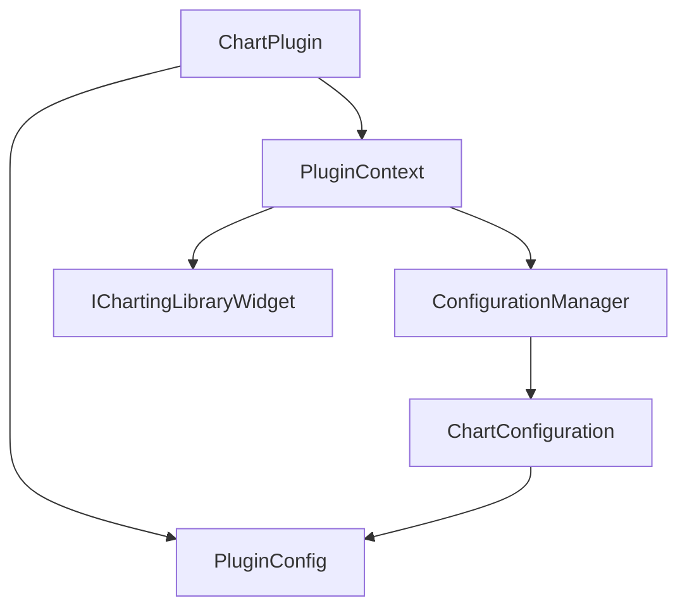
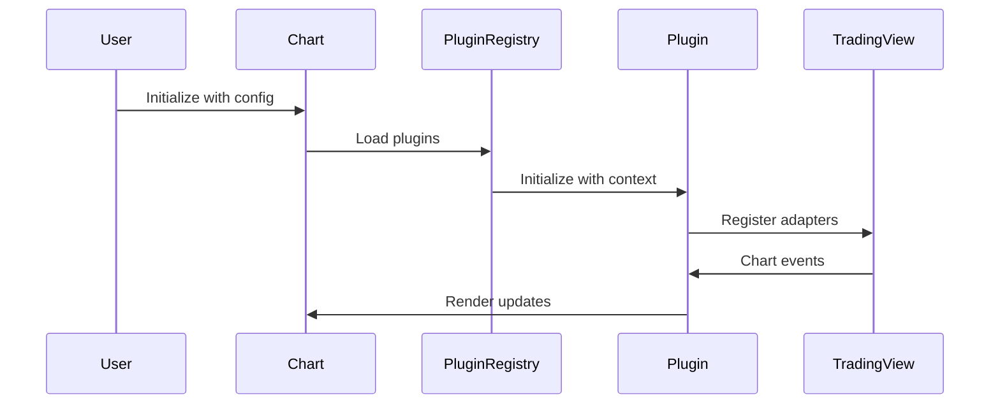
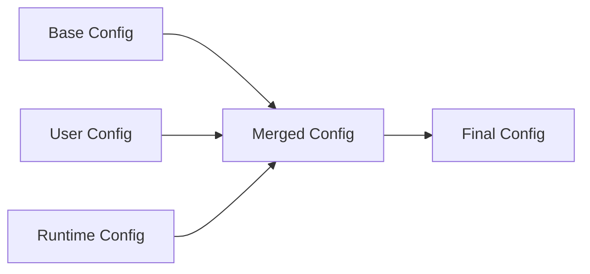

# Data Model: UI TradingView Package Refactoring

**Date**: 2025-10-13
**Feature**: UI TradingView Package Refactoring with Plugin Architecture

## Core Entities

### 1. ChartPlugin

**Description**: Core plugin interface for all TradingView chart extensions

**Properties**:

```typescript
interface ChartPlugin<T = any> {
  // Metadata
  meta: {
    name: string; // Unique plugin identifier
    version: string; // Semantic version
    description?: string; // Human-readable description
    author?: string; // Plugin author
    dependencies?: string[]; // Required plugins
  };

  // Lifecycle hooks
  hooks?: {
    onInit?: (context: PluginContext) => void;
    onDestroy?: () => void;
    onThemeChange?: (theme: Theme) => void;
    onResize?: (size: Size) => void;
    onSymbolChange?: (symbol: string) => void;
  };

  // Rendering
  render: (props: T) => ReactElement;
  update?: (data: any) => void;

  // Configuration
  getDefaultConfig(): PluginConfig;
  validateConfig(config: PluginConfig): boolean;

  // TradingView integration
  onChartReady?(widget: IChartingLibraryWidget): void;
}
```

**Validation Rules**:

- `name` must be unique across all registered plugins
- `version` must follow semantic versioning
- `dependencies` must reference existing plugins
- `render` method is required
- Plugin must be validatable through `validateConfig`

**State Transitions**:

- `UNREGISTERED` → `REGISTERING` → `ACTIVE` → `DESTROYING` → `UNREGISTERED`

### 2. PluginContext

**Description**: Context provided to plugins during initialization

**Properties**:

```typescript
interface PluginContext {
  chartWidget: IChartingLibraryWidget;
  configManager: ConfigurationManager;
  eventBus: EventBus;
  logger: Logger;
  theme: Theme;
  symbol: string;
  interval: string;
}
```

**Validation Rules**:

- `chartWidget` must be initialized TradingView widget instance
- All context properties must be available during plugin initialization

### 3. ChartConfiguration

**Description**: Comprehensive chart configuration including plugin settings

**Properties**:

```typescript
interface ChartConfiguration {
  // Core TradingView settings
  theme: "light" | "dark";
  interval: string;
  symbol: string;
  locale?: string;

  // Plugin configuration
  plugins: PluginConfig[];

  // TradingView overrides
  studiesOverrides: Record<string, any>;
  overrides: Record<string, any>;
  customIndicators?: CustomStudy[];

  // External configuration
  externalConfig?: {
    apiEndpoint?: string;
    configVersion?: string;
    cacheDuration?: number;
  };

  // UI configuration
  ui?: {
    showToolbar?: boolean;
    showTimeframes?: boolean;
    showStudies?: boolean;
  };
}
```

**Validation Rules**:

- `theme` must be 'light' or 'dark'
- `interval` must match TradingView interval pattern
- `plugins` array cannot contain duplicate plugin names
- Plugin dependencies must be satisfied

### 4. PluginConfig

**Description**: Individual plugin configuration

**Properties**:

```typescript
interface PluginConfig {
  name: string; // Plugin identifier
  version: string; // Plugin version
  enabled: boolean; // Whether plugin is active
  config: Record<string, any>; // Plugin-specific configuration
  dependencies?: string[]; // Required plugins
  loadOrder?: number; // Loading priority
}
```

**Validation Rules**:

- `name` must match registered plugin
- `version` must be compatible with plugin version
- `enabled` must be boolean
- `dependencies` must be satisfiable

### 5. TradingLineData

**Description**: Base data structure for all trading line types

**Properties**:

```typescript
interface TradingLineData {
  id: string; // Unique line identifier
  type: "order" | "position" | "tpsl"; // Line type
  price: number; // Price level
  quantity?: number; // Quantity (for orders/positions)
  symbol: string; // Trading symbol
  status: "active" | "filled" | "cancelled" | "expired";
  timestamp: number; // Creation timestamp
  metadata?: Record<string, any>; // Additional data
}
```

**Validation Rules**:

- `id` must be unique within chart instance
- `price` must be positive number
- `type` must be one of allowed values
- `status` must be valid trading state

### 6. OrderLineData

**Description**: Specific data for order line rendering

**Properties**:

```typescript
interface OrderLineData extends TradingLineData {
  type: "order";
  side: "buy" | "sell"; // Order side
  orderType: "limit" | "stop" | "market"; // Order type
  timeInForce?: "GTC" | "IOC" | "FOK" | "DAY"; // Time in force
  tpslOrders?: {
    // Associated TPSL orders
    takeProfit?: TPLOrderData;
    stopLoss?: TPLOrderData;
  };
}
```

**Validation Rules**:

- `side` must be 'buy' or 'sell'
- `orderType` must be valid order type
- `timeInForce` must be valid if provided

### 7. PositionLineData

**Description**: Specific data for position line rendering

**Properties**:

```typescript
interface PositionLineData extends TradingLineData {
  type: "position";
  side: "long" | "short"; // Position side
  entryPrice: number; // Entry price
  currentPrice?: number; // Current market price
  unrealizedPnL?: number; // Unrealized profit/loss
  realizedPnL?: number; // Realized profit/loss
  size?: number; // Position size
}
```

**Validation Rules**:

- `side` must be 'long' or 'short'
- `entryPrice` must be positive number
- `unrealizedPnL` and `realizedPnL` can be positive or negative

### 8. TPSLLineData

**Description**: Specific data for take profit/stop loss lines

**Properties**:

```typescript
interface TPSLLineData extends TradingLineData {
  type: "tpsl";
  tpslType: "takeProfit" | "stopLoss"; // TPSL type
  parentOrderId?: string; // Associated order ID
  parentPositionId?: string; // Associated position ID
  triggerPrice?: number; // Trigger price for orders
  activationStatus?: "active" | "inactive" | "triggered";
}
```

**Validation Rules**:

- `tpslType` must be 'takeProfit' or 'stopLoss'
- `triggerPrice` must be provided for TPSL orders
- Either `parentOrderId` or `parentPositionId` must be provided

### 9. PluginRegistry

**Description**: Registry for managing plugin lifecycle and dependencies

**Properties**:

```typescript
interface PluginRegistry {
  plugins: Map<string, ChartPlugin>; // Registered plugins
  loadOrder: string[]; // Loading order
  dependencyGraph: DependencyGraph; // Plugin dependencies
  status: RegistryStatus; // Registry status
}
```

**Validation Rules**:

- No circular dependencies allowed
- All dependencies must be satisfied before plugin activation
- Plugin names must be unique

**State Transitions**:

- `INITIALIZING` → `READY` → `ACTIVE` → `SHUTTING_DOWN` → `TERMINATED`

### 10. ConfigurationManager

**Description**: Manages layered configuration loading and caching

**Properties**:

```typescript
interface ConfigurationManager {
  baseConfig: ChartConfiguration; // File-based base config
  userConfigCache: Map<string, ChartConfiguration>; // Cached user configs
  runtimeConfig: Partial<ChartConfiguration>; // Runtime overrides
  configVersion: string; // Configuration version
  schemaValidator: ConfigValidator; // Schema validator
}
```

**Validation Rules**:

- Configuration must pass schema validation
- Cached configurations must respect TTL
- Runtime overrides cannot break base configuration

## Relationships

### Plugin Dependencies



### Data Flow



### Configuration Hierarchy



## Data Transformation Rules

### Configuration Merging

- Base configuration provides defaults
- User configuration overrides base values
- Runtime configuration has highest priority
- Plugin configurations are merged separately
- Validation occurs after each merge step

### Plugin State Management

- Plugin registration creates plugin instance
- Plugin initialization receives context
- Plugin activation enables rendering
- Plugin destruction cleans up resources
- State transitions are logged and validated

### Trading Line Updates

- New lines are created with initial state
- Price updates trigger line re-rendering
- Status changes update line appearance
- Filled/cancelled lines are removed
- Updates are batched for performance

## Security Considerations

### Plugin Validation

- All plugins must be validated before registration
- Plugin configuration must pass schema validation
- Malicious plugins cannot access core TradingView internals
- Plugin permissions are explicitly granted

### Configuration Security

- External configurations are validated against schema
- Sensitive configuration data is encrypted at rest
- Configuration access is logged and audited
- Invalid configurations are rejected gracefully

### Data Privacy

- Trading data never leaves client-side
- User configurations are isolated per user
- No sensitive data is logged
- Plugin data access is explicitly controlled
